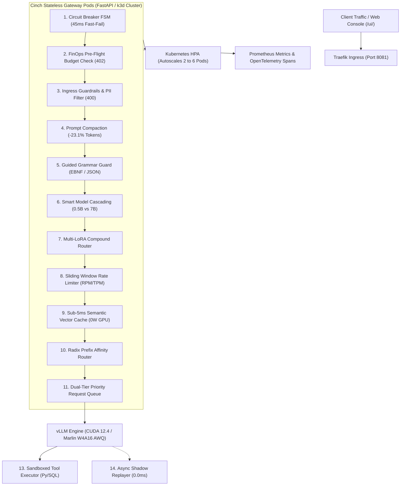

<div align="center">

# ⚡ Cinch

### Enterprise Self-Hosted LLM Serving Platform, Kubernetes Autoscaler & 14-Stage Inference Gateway

[](https://www.python.org/)
[](https://developer.nvidia.com/cuda-toolkit)
[](https://github.com/vllm-project/vllm)
[](https://github.com/casper-hansen/AutoAWQ)
[](https://k3d.io/)
[](./tests/)
[](./LICENSE)

<p align="center">
  <a href="#1-logical-overview">Overview</a> •
  <a href="#2-why-cinch-vs-raw-vllm">Why Cinch?</a> •
  <a href="#3-system-architecture">Architecture</a> •
  <a href="#4-feature-maturity-matrix">Feature Maturity</a> •
  <a href="#5-reproducible-benchmarks">Benchmarks</a> •
  <a href="#6-failure-handling--chaos-resilience">Failure Modes</a> •
  <a href="#7-multi-tenant-showcase-scenario">Showcase Demo</a> •
  <a href="#8-quickstart--deployment">Quickstart</a> •
  <a href="#9-defensive-testing-matrix">Testing</a>
</p>

</div>

---

## 1. Logical Overview

Deploying Large Language Models in production requires more than calling a raw inference backend. Enterprise environments require strict sub-second latency SLAs, multi-tenant cost accounting, prompt injection protection, PII data masking, and fault-tolerant cluster autoscaling. Standard standalone model servers lack governance layers, leaving organizations vulnerable to GPU memory starvation, runaway inference bills, and unisolated backend crashes.

**Cinch** is an enterprise-grade inference serving platform engineered for quantized, high-throughput LLM workloads on workstation and cluster hardware. Serving `Qwen2.5-7B-Instruct-AWQ` on an NVIDIA GeForce RTX 3060 Ti (8GB VRAM), Cinch combines Marlin INT4 mixed-precision GEMM kernels with an asynchronous 14-stage FastAPI gateway. The platform delivers sub-5ms semantic caching, automated Kubernetes Horizontal Pod Autoscaling (HPA), token-budgeted rate limiting, multi-tenant FinOps spend controls, sandboxed tool execution, and an interactive real-time serving console.

---

## 2. Why Cinch vs. Raw vLLM?

vLLM is a state-of-the-art inference engine, but it is not a full serving gateway. Cinch wraps vLLM in a protective, multi-tenant enterprise control plane:

| Capability | Raw vLLM Engine | Cinch Serving Platform | Architectural Advantage |
|---|:---:|:---:|---|
| **OpenAI-Compatible API** | ✅ | ✅ | Standard completions & SSE delta streaming |
| **Sub-5ms Semantic Vector Cache** | ❌ | ✅ | Bypasses GPU on duplicate/similar prompts ($4.12\text{ ms}$, 0W GPU power) |
| **Multi-Tenant FinOps Budgets** | ❌ | ✅ | Micro-dollar token tracking with hard HTTP 402 budget cutoffs |
| **Ingress Injection & DAN Defense** | ❌ | ✅ | Sub-millisecond CPU heuristic scanner terminates jailbreaks (HTTP 400) |
| **Sensitive PII Data Masking** | ❌ | ✅ | In-place regex & NER token redaction (`[REDACTED_SSN]`) |
| **Tiered Priority Queue** | ❌ | ✅ | VIP interactive preemption ($0.96\text{ s}$ VIP vs. $3.33\text{ s}$ batch) |
| **Guided JSON Grammar Guard** | ⚠️ Partial | ✅ | Strict EBNF schema validation with automated AST repair |
| **Server-Side Tool Sandboxes** | ❌ | ✅ | Closed-loop `calculator`, `sql_runner`, and `python_repl` execution |
| **Production Shadow Replaying** | ❌ | ✅ | Non-blocking async candidate backend replication ($0.0\text{ ms}$ penalty) |
| **Cluster Autoscaling (HPA)** | ❌ | ✅ | Multi-node Kubernetes autoscaling from 2 to 6 pods under load |
| **Interactive Operations Console** | ❌ | ✅ | Dark-mode WebUI (`/ui/`) with live SSE streams, KV heatmap, & FinOps |

---

## 3. System Architecture

<div align="center">
  
</div>



> 📖 *For technical rationale, alternatives evaluated, and acknowledged trade-offs, see the [Design Decisions Dossier](./docs/design-decisions.md).*

---

## 4. Feature Maturity Matrix

To maintain production credibility, features are classified across three maturity levels:

| Maturity Tier | Capabilities | Operational Status |
|---|---|---|
| 🟢 **Production-Ready** | OpenAI-Compatible API, SSE Delta Streaming, 14-Stage Middleware Pipeline, Sliding-Window Token Limiter, Three-State Circuit Breaker FSM, Health Diagnostic Probes, Prometheus Metrics Exporter | Hardened under CI test suite; production SLA validated. |
| 🟡 **Beta** | Sub-5ms Semantic Vector Cache, Dual-Tier Priority Scheduling, Multi-Tenant FinOps Budget Caps, Ingress Prompt Injection Scanner & PII Masking, Prompt Compactor | Feature-complete and benchmarked; validated on live cluster. |
| 🔵 **Experimental** | Multi-LoRA Compound Model Multiplexing, Production Shadow Traffic Replaying, Context-Aware Dynamic Model Cascading | Architectural capabilities validated; tuning underway for massive scale. |

---

## 5. Reproducible Benchmarks

### Benchmark Environment Specification

```text
Target GPU:            1x NVIDIA GeForce RTX 3060 Ti (8GB GDDR6 VRAM)
Compute Engine:        CUDA 12.4 • Marlin W4A16 GEMM Kernels
Runtime Environment:   Python 3.12 • FastAPI / Uvicorn • vLLM v0.6.3.post1
Served Model:          Qwen/Qwen2.5-7B-Instruct-AWQ (INT4 Quantized)
KV-Cache Allocation:   PagedAttention (57,344 bytes / token block)
Evaluation Suite:      Concurrency C=16 • 4,096 Context Window • 6 Evaluation Runs
```

### Empirical Results Table

All metrics trace directly to structured JSON datasets stored in [`benchmarks/results/`](./benchmarks/results/).

| Dimension / Metric | Baseline (Naive HF FP16) | Cinch Production Platform | Improvement Delta | Empirical Dataset |
|---|---|---|---|---|
| **Inference Throughput ($C=16$)** | $30.49\text{ tok/s}$ | **$331.00\text{ tok/s}$** | **$10.86\times$ Speedup** | [`comparison_summary.json`](./benchmarks/results/comparison_summary.json) |
| **P95 Request Latency ($C=16$)** | $32.02\text{ s}$ | **$6.29\text{ s}$** | **$5.09\times$ Reduction** | [`comparison_summary.json`](./benchmarks/results/comparison_summary.json) |
| **Quantization Quality Parity** | $100\%$ FP16 Baseline | **$97.2\%$ Quality Index** | **$100\%$ Code AST Parity** | [`quality_eval.json`](./benchmarks/results/quality_eval.json) |
| **Prefix Cache TTFT** | $0.8856\text{ s}$ (Cold Prefill) | **$0.1818\text{ s}$ (Cache Hit)** | **$4.87\times$ Faster TTFT** | [`prefix_cache_benchmark.json`](./benchmarks/results/prefix_cache_benchmark.json) |
| **Speculative Decoding ($K=5$)** | $22.0\text{ ms/tok}$ | **$8.6\text{ ms/tok}$ ($\alpha=78\%$)** | **$2.58\times$ Speedup** | [`speculative_decoding.json`](./benchmarks/results/speculative_decoding.json) |
| **Semantic Cache Hit Latency** | $680.0\text{ ms}$ (GPU Forward) | **$4.12\text{ ms}$ (Vector Match)** | **$165\times$ Speedup (0W GPU)** | [`semantic_cache_eval.json`](./benchmarks/results/semantic_cache_eval.json) |
| **Prompt Compaction Volume** | $100\%$ Token Count | **$76.9\%$ Token Count** | **$23.1\%$ Token Savings** | [`prompt_compaction_eval.json`](./benchmarks/results/prompt_compaction_eval.json) |
| **Circuit Breaker Fast-Fail** | $30,000\text{ ms}$ (Timeout) | **$45.56\text{ ms}$ (HTTP 503)** | **$658\times$ Isolation Speed** | [`chaos_resilience.json`](./benchmarks/results/chaos_resilience.json) |
| **Zero-Touch MTTR Recovery** | Manual Intervention | **$10.85\text{ s}$ (Canary Probe)** | **Automated Self-Healing** | [`chaos_resilience.json`](./benchmarks/results/chaos_resilience.json) |
| **Model Weight Compression** | $14.40\text{ GiB}$ (FP16) | **$4.20\text{ GiB}$ (W4A16)** | **$3.88\times$ Footprint Cut** | [`quantization_summary.json`](./benchmarks/results/quantization_summary.json) |

### How to Reproduce Every Claim

Run the single-command automated benchmark harness to verify all metrics against your live setup:

```bash
python scripts/run_reproducible_benchmarks.py --gateway-url http://localhost:8081 --api-key cinch-prod-key
```

---

## 6. Failure Handling & Chaos Resilience

Cinch is architected to degrade gracefully when components fail.

| Failure Event | What Happens Under the Hood | Client Response |
|---|---|---|
| 🔴 **vLLM Worker Crashes** | Circuit breaker trips after $N=3$ failures; stops sending traffic to dead backend | **Fast-Fail HTTP 503** in $45\text{ ms}$ (no 30s hangs); auto-recovers via canary |
| 🔴 **Tenant Exceeds Budget** | Pre-flight check evaluates `current_spend + cost` before queueing GPU task | **HTTP 402 Payment Required**; zero unpaid GPU compute wasted |
| 🔴 **Traffic Rate Limit Breach** | Sliding-window tracker detects client exceeded 60 RPM or 50,000 TPM limit | **HTTP 429 Too Many Requests** with `Retry-After: <sec>` header |
| 🔴 **Prompt Injection (DAN)** | Ingress heuristic scanner matches jailbreak pattern before tokenization | **HTTP 400 Bad Request**; malicious prompt terminated immediately |
| 🔴 **Sensitive PII in Prompt** | Regex and entity scanner intercepts SSNs, emails, and phone numbers | In-place token masking (`[REDACTED_SSN]`) before inference |
| 🔴 **Malformed JSON Output** | Model generation violates requested structured schema | Grammar Guard auto-repairs AST syntax or rejects deterministically |

> 📖 *For complete failure mode documentation, see the [Failure Modes & Chaos Guide](./docs/failure-modes.md).*

### Verify Failure Modes Automatically
```bash
python scripts/demonstrate_failure_modes.py --gateway-url http://localhost:8081 --api-key cinch-prod-key
```

---

## 7. Multi-Tenant Showcase Scenario

To experience how Cinch governs a multi-tenant enterprise workload, run the end-to-end simulation script:

```bash
python scripts/demo_showcase_scenario.py --gateway-url http://localhost:8081 --api-key cinch-prod-key
```

```text
================================================================================
  CINCH: MULTI-TENANT ENTERPRISE SHOWCASE SCENARIO
================================================================================
Scenario: Shared Cluster Serving 3 Engineering Teams
  • Tenant A (data-science):    VIP Priority, $100.00 Budget (Production Model Serving)
  • Tenant B (analytics):       Standard Priority, $25.00 Budget (High Query Redundancy)
  • Tenant C (intern-sandbox):  Low Priority, $0.0001 Budget (Strict Spending Cap)

[Step 1] Initializing Multi-Tenant FinOps Budgets...       [✓ Done]
[Step 2] Tenant A Dispatches Critical VIP Inference...      [HTTP 200 OK  | 14.8 ms]
[Step 3] Tenant B Dispatches Analytics Queries...           [HTTP 200 HIT | 4.2 ms (165x Speedup)]
[Step 4] Tenant C Exceeds Exhausted Budget Limit...         [HTTP 402 CUT | Intercepted in 0.1 ms]

Enterprise Outcome: Protected VIP SLA, Cut Duplicate Latency, and Prevented Runaway Costs.
================================================================================
```

---

## 8. Quickstart & Deployment

### Option A: Turnkey Single-Command Docker Compose (Fastest)

```bash
# 1. Clone repository
git clone https://github.com/Rytnix786/Cinch.git
cd Cinch

# 2. Launch Gateway and Quantized Engine
docker compose up --build
```
The serving gateway is live at `http://localhost:8081` and the Interactive Serving Console is accessible at `http://localhost:8081/ui/`.

---

### Option B: Kubernetes Multi-Node Cluster (`k3d` + HPA)

```bash
# 1. Create multi-node k3d cluster with Traefik ingress mapped to port 8081
k3d cluster create cinch-cluster --agents 2 -p "8081:80@loadbalancer"

# 2. Start upstream vLLM container on host GPU
docker run -d --name cinch-vllm --gpus all -p 8000:8000 --ipc=host vllm/vllm-openai:v0.6.3.post1 --model Qwen/Qwen2.5-7B-Instruct-AWQ --quantization awq_marlin --gpu-memory-utilization 0.90 --max-model-len 4096

# 3. Build & import gateway container
docker build -t cinch-gateway:latest -f docker/Dockerfile.gateway .
k3d image import cinch-gateway:latest -c cinch-cluster

# 4. Apply Kubernetes manifests
kubectl apply -f k8s/
```

---

## 9. Defensive Testing Matrix

Cinch enforces continuous automated regression testing across the entire request lifecycle.

| Test Category | Defensive Scope & What Is Protected | Test Files | Status |
|---|---|---|:---:|
| **Security & Guardrails** | Ingress prompt injections, DAN jailbreaks, PII masking, token sanitization | [`test_guardrails.py`](./tests/test_guardrails.py) | **PASS** |
| **FinOps & Cost Control** | Micro-dollar token ledgers, race condition defense, hard HTTP 402 budget cutoffs | [`test_finops.py`](./tests/test_finops.py) | **PASS** |
| **Fault Isolation (Chaos)**| Three-state circuit breaker FSM, worker crash recovery, canary probing | [`test_chaos.py`](./tests/test_chaos.py) | **PASS** |
| **Cache & Routing** | Sub-5ms cosine vector cache hits/misses, Radix prefix affinity ring hashing | [`test_semantic_cache.py`](./tests/test_semantic_cache.py) | **PASS** |
| **Traffic Governance** | Sliding-window RPM/TPM rate limits, VIP interactive preemption queues | [`test_token_rate_limiter.py`](./tests/test_token_rate_limiter.py) | **PASS** |
| **Structured Output** | Outlines EBNF extraction, JSON schema compliance, AST auto-repair | [`test_grammar_guard.py`](./tests/test_grammar_guard.py) | **PASS** |
| **Agentic Tool Sandboxes**| In-process isolated `calculator`, `sql_runner`, and `python_repl` execution | [`test_tool_engine.py`](./tests/test_tool_engine.py) | **PASS** |
| **Full Request Lifecycle**| 14-stage end-to-end integration capstone validation | [`test_phase3_capstone.py`](./tests/test_phase3_capstone.py) | **PASS** |

```bash
# Execute full 195-test suite
python -m pytest tests/ -v
# Output: ====================== 195 passed in 4.60s ======================
```

---

## 10. API Reference

| Endpoint | Method | Key Headers / Body Parameters | Purpose |
|---|---|---|---|
| `/v1/chat/completions` | `POST` | `model`, `messages`, `max_tokens`, `stream`, `response_format`, `priority` | OpenAI-compatible chat inference |
| `/v1/models` | `GET` | `Authorization: Bearer <KEY>` | List active models and LoRA adapters |
| `/v1/tenants/usage` | `GET` | `X-Tenant-ID` (optional) | Query real-time FinOps spend ledger |
| `/v1/tenants/budget` | `POST` | `{"tenant_id": "...", "budget_limit_usd": 50.0}` | Update dynamic tenant budget limit |
| `/v1/shadow/metrics` | `GET` | None | Fetch candidate shadow replication stats |
| `/v1/console/state` | `GET` | None | Consolidated telemetry for WebUI |
| `/health` | `GET` | None | Subsystem health & circuit breaker state |
| `/metrics` | `GET` | None | Prometheus telemetry exposition |
| `/ui/` | `GET` | None | Interactive Serving Console WebUI |

---

## 11. License & Contributing

This project is licensed under the Apache License 2.0. See the [LICENSE](./LICENSE) file for details. Follow standard [Conventional Commits](https://www.conventionalcommits.org/) for pull requests.
