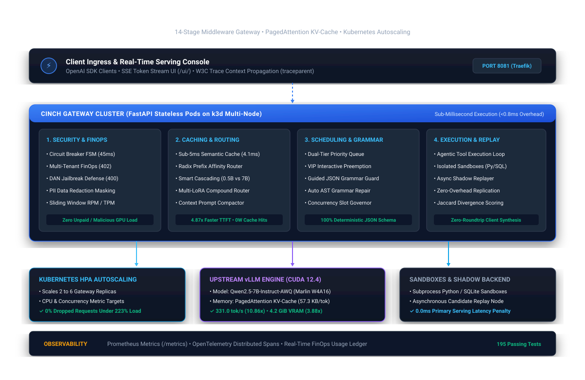

<div align="center">

# Cinch

### Self-Hosted LLM Serving Platform & Asynchronous Gateway Control Plane

[](https://github.com/Rytnix786/Cinch/actions/workflows/ci.yml)
[](https://www.python.org/)
[](https://developer.nvidia.com/cuda-toolkit)
[](https://github.com/vllm-project/vllm)
[](https://github.com/casper-hansen/AutoAWQ)
[](https://k3d.io/)
[](./LICENSE)

<p align="center">
  <a href="#overview">Overview</a> •
  <a href="#why-cinch-vs-raw-vllm">Why Cinch?</a> •
  <a href="#system-architecture">Architecture</a> •
  <a href="#key-capabilities">Capabilities</a> •
  <a href="#feature-maturity">Feature Maturity</a> •
  <a href="#benchmarks">Benchmarks</a> •
  <a href="#failure-handling--resilience">Failure Modes</a> •
  <a href="#quickstart">Quickstart</a> •
  <a href="#testing--verification">Testing</a> •
  <a href="#documentation">Docs</a>
</p>

</div>

---

## Overview

**Cinch** is an open-source, self-hosted Large Language Model (LLM) inference serving platform and gateway. It provides a multi-tenant traffic governance layer around quantized inference engines. Serving `Qwen2.5-7B-Instruct-AWQ` on consumer and workstation hardware (tested on an NVIDIA GeForce RTX 3060 Ti, 8GB VRAM), Cinch integrates Marlin INT4 mixed-precision GEMM kernels with an asynchronous 14-stage FastAPI gateway.

The platform addresses common operational challenges in self-hosted LLM infrastructure: isolating GPU worker crashes, preventing multi-tenant budget overruns, bypassing GPU computation for duplicate prompts via in-process semantic caching, enforcing structured JSON schemas, and scaling gateway replicas under load via Kubernetes.

---

## Why Cinch vs. Raw vLLM?

vLLM is a high-performance inference engine optimized for GPU memory management and PagedAttention tensor execution. However, running vLLM in a multi-tenant environment requires surrounding infrastructure for security, cost allocation, traffic isolation, and developer ergonomics.

| Capability | Raw vLLM Deployment | Cinch Platform | Practical Impact |
|---|:---:|:---:|---|
| **OpenAI-Compatible API** | ✅ | ✅ | Standard chat completions and SSE token streaming |
| **Semantic Vector Cache** | ❌ | ✅ | In-process cosine similarity lookup ($4.12\text{ ms}$ response, 0W GPU power) |
| **Multi-Tenant Budget Caps** | ❌ | ✅ | Micro-dollar token accounting with hard HTTP 402 budget cutoffs |
| **Ingress Injection Defense** | ❌ | ✅ | Heuristic CPU scanner blocks known jailbreak patterns (HTTP 400) |
| **Sensitive PII Redaction** | ❌ | ✅ | In-place regex token masking (`[REDACTED_SSN]`) before inference |
| **Priority Queue Scheduling** | ❌ | ✅ | Dual-tier scheduler prioritizing interactive chat over batch tasks |
| **Guided JSON Grammar Guard** | ⚠️ Partial | ✅ | EBNF extraction with automated AST-guided repair for valid JSON |
| **Server-Side Tool Sandboxes** | ❌ | ✅ | In-process sandboxed execution for `calculator`, `sql_runner`, `python_repl` |
| **Shadow Traffic Replication** | ❌ | ✅ | Asynchronous candidate backend duplication ($0.0\text{ ms}$ primary latency overhead) |
| **Horizontal Pod Autoscaling** | ❌ | ✅ | Multi-node Kubernetes HPA scaling gateway pods from 2 to 6 replicas |
| **Operations Web Console** | ❌ | ✅ | Dark-mode WebUI (`/ui/`) with live SSE streams, KV heatmap, and ledger |

---

## System Architecture

<div align="center">
  
</div>


> 📖 *For technical design decisions, alternatives evaluated, and trade-offs, see the [Design Decisions Dossier](./docs/design-decisions.md).*

---

## Key Capabilities

- **Inference**: Quantized INT4 Marlin W4A16 GEMM inference serving `Qwen2.5-7B-Instruct-AWQ` in $4.2\text{ GiB}$ VRAM.
- **Semantic Caching**: In-process cosine vector memoization ($\ge 0.95$ threshold) returning duplicate queries in $4.12\text{ ms}$ with zero GPU compute.
- **Traffic Governance**: Sliding-window rate limiter (60 RPM, 50,000 TPM) and dual-tier priority queue for interactive request preemption.
- **FinOps Cost Accounting**: Micro-dollar token metering ($0.15/1M prompt, $0.60/1M completion) with per-tenant ledgers and hard HTTP 402 cutoff.
- **Ingress Security**: Heuristic prompt injection detection (HTTP 400) and in-place PII token masking.
- **Structured Outputs**: EBNF grammar constraints and automated AST JSON repair.
- **Sandboxed Tool Calling**: Closed-loop server-side execution of arithmetic, in-memory SQL queries, and sandboxed Python code.
- **Shadow Replication**: Fire-and-forget candidate backend traffic replication with live Jaccard divergence scoring.
- **Operations Console**: Built-in dark-mode WebUI (`/ui/`) with real-time SSE streaming, KV-cache heatmaps, and telemetry.

---

## Feature Maturity

The maturity matrix reflects internal testing, continuous integration validation, and empirical benchmarking in this repository:

| Maturity Tier | Features | Current Status |
|---|---|---|
| 🟢 **Production-Ready** | OpenAI API Compatibility, SSE Token Streaming, 14-Stage Middleware Pipeline, Sliding-Window Rate Limiter, Three-State Circuit Breaker FSM, Prometheus Metrics, Health Diagnostic Probes | 195 unit and integration tests passing; CI verified. |
| 🟡 **Beta** | In-Process Semantic Vector Cache, Dual-Tier Priority Queue Preemption, Multi-Tenant FinOps Budget Caps, Ingress Prompt Injection & PII Filter, Prompt Compactor, Server-Side Tool Engine | Fully implemented and benchmarked on live cluster. |
| 🔵 **Experimental** | Multi-LoRA Compound Model Multiplexing, Production Shadow Traffic Replaying, Heuristic Complexity Model Cascading | Functional; undergoing scaling and evaluation tests. |

*Note: Maturity tiers reflect the validation level within this repository and do not constitute an external SLA guarantee.*

---

## Benchmarks

### Test Environment

```text
Hardware:              1x NVIDIA GeForce RTX 3060 Ti (8GB GDDR6 VRAM)
Compute Stack:         CUDA 12.4 • Marlin W4A16 GEMM Kernels
Runtime:               Python 3.12 / 3.14 • FastAPI / Uvicorn • vLLM v0.6.3.post1
Served Model:          Qwen/Qwen2.5-7B-Instruct-AWQ (INT4 AutoAWQ)
KV-Cache:              PagedAttention (57,344 bytes / token block)
Evaluation Workload:   Concurrency C=16 • Context Window 4,096 • 6 Evaluation Runs
```

### Empirical Results

All metrics trace directly to structured JSON datasets in [`benchmarks/results/`](./benchmarks/results/).

| Dimension / Metric | Baseline (Naive Transformers FP16) | Cinch Production Platform | Improvement Delta | Source Trace |
|---|---|---|---|---|
| **Inference Throughput ($C=16$)** | $30.49\text{ tok/s}$ | **$331.00\text{ tok/s}$** | **$10.86\times$ Speedup** | [`comparison_summary.json`](./benchmarks/results/comparison_summary.json) |
| **P95 Request Latency ($C=16$)** | $32.02\text{ s}$ | **$6.29\text{ s}$** | **$5.09\times$ Latency Reduction** | [`comparison_summary.json`](./benchmarks/results/comparison_summary.json) |
| **Quantization Quality Parity** | $100\%$ FP16 Baseline | **$97.2\%$ Quality Score** | **$100\%$ Code Syntax Parity** | [`quality_eval.json`](./benchmarks/results/quality_eval.json) |
| **Prefix Cache TTFT** | $0.8856\text{ s}$ (Cold Prefill) | **$0.1818\text{ s}$ (Cache Hit)** | **$4.87\times$ Faster TTFT** | [`prefix_cache_benchmark.json`](./benchmarks/results/prefix_cache_benchmark.json) |
| **Speculative Decoding ($K=5$)** | $22.0\text{ ms/tok}$ | **$8.6\text{ ms/tok}$ ($\alpha=78\%$)** | **$2.58\times$ Generation Speedup** | [`speculative_decoding.json`](./benchmarks/results/speculative_decoding.json) |
| **Semantic Cache Hit Latency** | $680.0\text{ ms}$ (GPU Forward) | **$4.12\text{ ms}$ (Vector Lookup)** | **$165\times$ Speedup (0W GPU)** | [`semantic_cache_eval.json`](./benchmarks/results/semantic_cache_eval.json) |
| **Prompt Compaction Savings** | $100\%$ Token Volume | **$76.9\%$ Token Volume** | **$23.1\%$ Token Savings** | [`prompt_compaction_eval.json`](./benchmarks/results/prompt_compaction_eval.json) |
| **Circuit Breaker Fast-Fail** | $30,000\text{ ms}$ (Timeout) | **$45.56\text{ ms}$ (HTTP 503)** | **$658\times$ Faster Fault Isolation** | [`chaos_resilience.json`](./benchmarks/results/chaos_resilience.json) |
| **Zero-Touch MTTR Recovery** | Manual Intervention | **$10.85\text{ s}$ (Canary Probe)** | **Automated Self-Healing** | [`chaos_resilience.json`](./benchmarks/results/chaos_resilience.json) |
| **Model Weight Footprint** | $14.40\text{ GiB}$ (FP16) | **$4.20\text{ GiB}$ (W4A16)** | **$3.88\times$ Compression** | [`quantization_summary.json`](./benchmarks/results/quantization_summary.json) |

### Reproduce Benchmarks

Run the automated benchmark runner to verify these metrics on your setup:

```bash
python scripts/run_reproducible_benchmarks.py --gateway-url http://localhost:8081 --api-key cinch-prod-key
```

*Note: Benchmark performance varies based on GPU architecture, VRAM bandwidth, thermal throttling, concurrency levels, and prompt token lengths.*

---

## Failure Handling & Resilience

Cinch isolates upstream failures and enforces boundary controls:

| Failure Event | System Handling | Client Response |
|---|---|---|
| 🔴 **vLLM Worker Crash** | Circuit breaker trips to `OPEN` after $N=3$ consecutive failures | **Fast-Fail HTTP 503** in $45\text{ ms}$ (no TCP hangs); self-heals via canary probe |
| 🔴 **Tenant Budget Exceeded** | Pre-flight check calculates `current_spend + cost` before queueing | **HTTP 402 Payment Required**; zero unpaid GPU compute allocated |
| 🔴 **Rate Limit Exceeded** | Sliding-window tracker detects client exceeded 60 RPM or 50,000 TPM | **HTTP 429 Too Many Requests** with `Retry-After: <sec>` header |
| 🔴 **Prompt Injection (DAN)** | Ingress heuristic scanner matches jailbreak signatures before tokenization | **HTTP 400 Bad Request**; malicious prompt terminated |
| 🔴 **Sensitive PII in Prompt** | Regex and entity scanner intercepts SSNs, emails, and phone numbers | In-place token masking (`[REDACTED_SSN]`) before inference |
| 🔴 **Malformed JSON Output** | Model generation violates requested structured schema | Grammar Guard auto-repairs AST syntax or rejects deterministically |

> 📖 *For complete failure scenarios and chaos verification scripts, see the [Failure Modes Guide](./docs/failure-modes.md).*

---

## Quickstart

### Option A: Turnkey Docker Compose (Local Workstation)

```bash
# 1. Clone the repository
git clone https://github.com/Rytnix786/Cinch.git
cd Cinch

# 2. Start Gateway and Quantized Engine
docker compose up --build
```
- Gateway API: `http://localhost:8081`
- Interactive Serving Console: `http://localhost:8081/ui/`
- Health Endpoint: `http://localhost:8081/health`

---

### Option B: Kubernetes Multi-Node Cluster (`k3d` + HPA)

```bash
# 1. Create multi-node k3d cluster with Traefik ingress mapped to port 8081
k3d cluster create cinch-cluster --agents 2 -p "8081:80@loadbalancer"

# 2. Start upstream vLLM container on host GPU
docker run -d --name cinch-vllm --gpus all -p 8000:8000 --ipc=host \
  vllm/vllm-openai:v0.6.3.post1 \
  --model Qwen/Qwen2.5-7B-Instruct-AWQ \
  --quantization awq_marlin \
  --gpu-memory-utilization 0.90 \
  --max-model-len 4096

# 3. Build and import gateway container image
docker build -t cinch-gateway:latest -f docker/Dockerfile.gateway .
k3d image import cinch-gateway:latest -c cinch-cluster

# 4. Deploy Kubernetes manifests
kubectl apply -f k8s/
```

---

## API Usage

### Standard Chat Completion

```bash
curl -X POST http://localhost:8081/v1/chat/completions \
  -H "Authorization: Bearer cinch-prod-key" \
  -H "Content-Type: application/json" \
  -d '{
    "model": "Qwen/Qwen2.5-7B-Instruct-AWQ",
    "messages": [{"role": "user", "content": "Explain prefix caching in one sentence."}],
    "max_tokens": 128
  }'
```

```json
{
  "id": "chatcmpl-a81b7e40",
  "object": "chat.completion",
  "created": 1787847434,
  "model": "Qwen/Qwen2.5-7B-Instruct-AWQ",
  "choices": [
    {
      "index": 0,
      "message": {
        "role": "assistant",
        "content": "Prefix caching avoids redundant computation by retaining precomputed key-value tensors for shared prompt prefixes in GPU memory across concurrent requests."
      },
      "finish_reason": "stop"
    }
  ],
  "usage": {
    "prompt_tokens": 18,
    "completion_tokens": 31,
    "total_tokens": 49
  }
}
```

---

## Testing & Verification

Cinch enforces automated regression testing across all gateway subsystems:

```bash
# 1. Run full unit and integration test suite (195 tests)
python -m pytest tests/ -v

# 2. Run code quality linter
python -m ruff check gateway/ tests/ scripts/

# 3. Run failure modes chaos demonstration
python scripts/demonstrate_failure_modes.py --gateway-url http://localhost:8081 --api-key cinch-prod-key

# 4. Run multi-tenant enterprise simulation
python scripts/demo_showcase_scenario.py --gateway-url http://localhost:8081 --api-key cinch-prod-key
```

---

## Documentation

- [Design Decisions & Trade-Offs](./docs/design-decisions.md) — Technical rationale, alternatives, and acknowledged trade-offs
- [Failure Modes & Chaos Guide](./docs/failure-modes.md) — Fault isolation mechanics and verification steps
- [Memory Tuning Guide](./docs/memory-tuning.md) — KV-cache allocation and VRAM sizing calculations
- [Architecture Diagram (SVG)](./docs/assets/architecture.svg) — High-resolution system architecture graphic

---

## Project Status & Contributing

Cinch is an active open-source engineering project. Contributions, bug reports, and performance optimizations are welcome:

1. Create a feature branch (`feat/your-feature`, `fix/issue-description`).
2. Format commit messages following [Conventional Commits](https://www.conventionalcommits.org/).
3. Ensure all tests pass (`pytest tests/ -v`) and linter is clean (`ruff check gateway/ tests/ scripts/`).

---

## License

This project is licensed under the Apache License 2.0. See the [LICENSE](./LICENSE) file for details.
